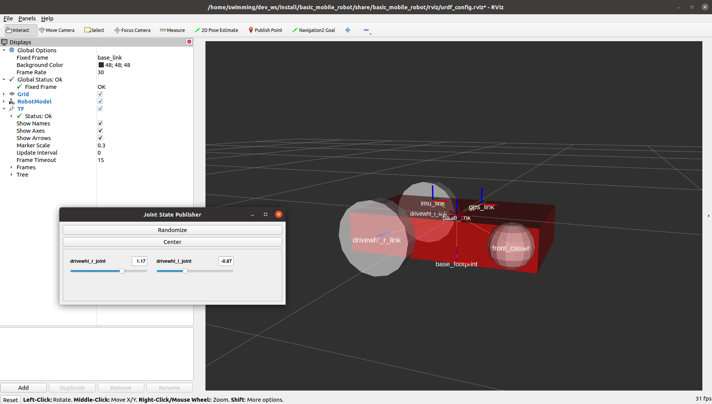
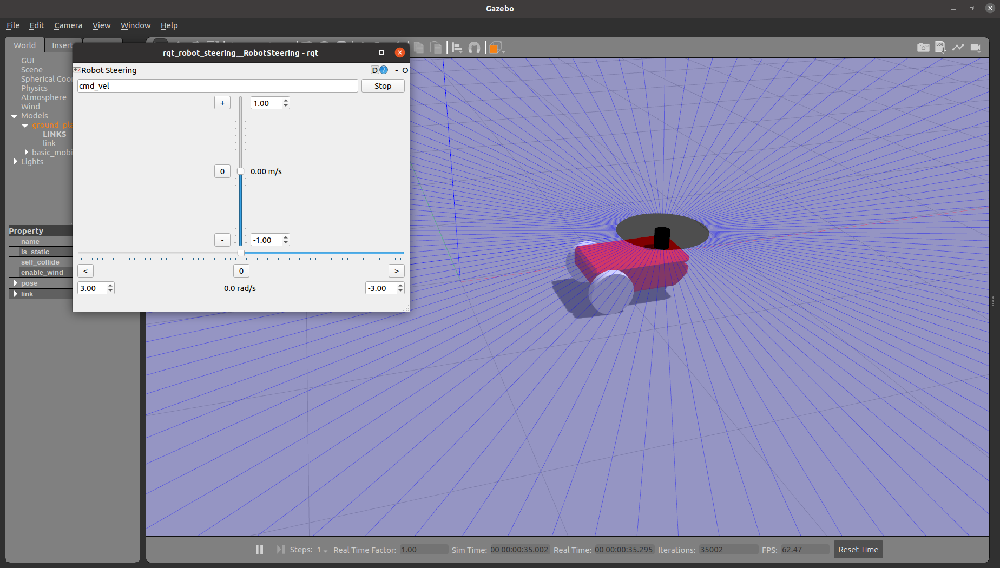
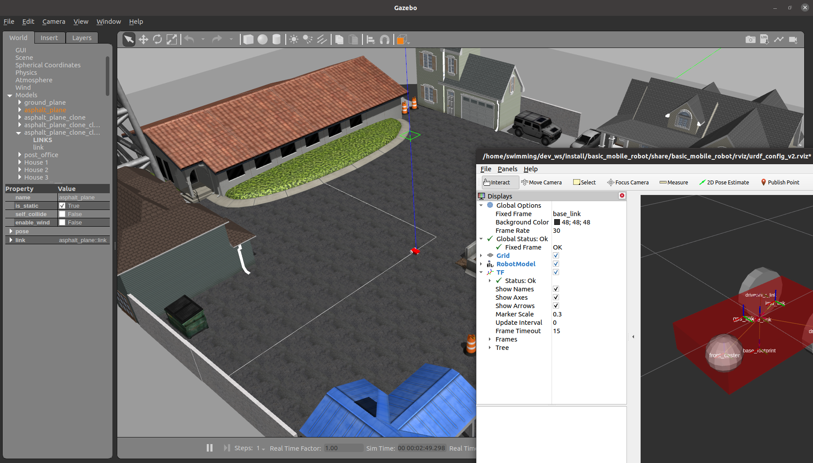
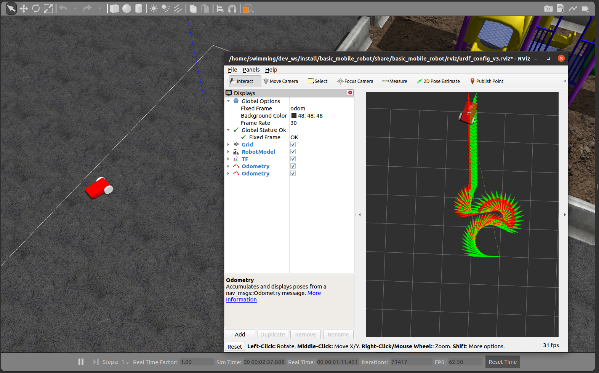
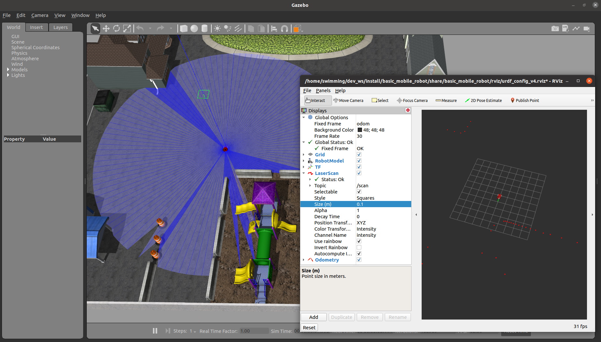
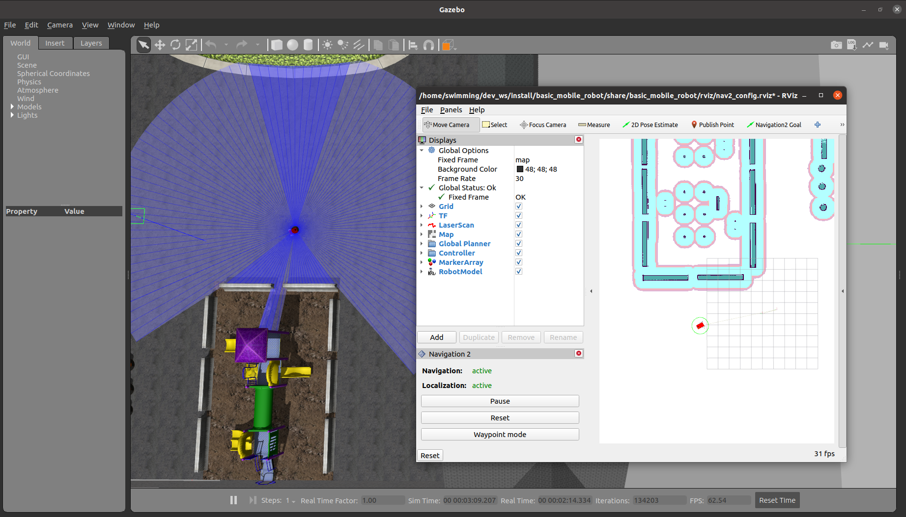

# ros2-navigation-examples

# Instllation

```
sudo apt install ros-foxy-navigation2 ros-foxy-nav2-bringup -y
sudo apt install ros-foxy-turtlebot3* -y
sudo apt install python3-rosdep2 -y
rosdep update

sudo apt install ros-foxy-rviz-common \
                ros-foxy-joint-state-publisher-gui \
                ros-foxy-rqt-robot-steering \
                ros-foxy-robot-localization \
                ros-foxy-cartographer-ros \
                ros-foxy-gazebo-ros-pkgs \
                ros-foxy-ros2-control \
                ros-foxy-tf2-tools \
                ros-foxy-xacro \
                ros-foxy-slam-toolbox -y
```

```
cd ~/nav2_ws/src
git clone https://github.com/ros-planning/navigation2.git --branch foxy-devel
cd ~/nav2_ws
rosdep install -y -r -q --from-paths src --ignore-src --rosdistro foxy
```

# Usage

```
ros2 launch basic_mobile_robot basic_mobile_bot_v1.launch.py
```

<p align="center">
    
</p>


<p align="center">
    
</p>


```
ros2 launch basic_mobile_robot basic_mobile_bot_v2.launch.py
```

<p align="center">
    
</p>


```
# odom
ros2 launch basic_mobile_robot basic_mobile_bot_v3.launch.py
```

<p align="center">
    
</p>

```
# lidar
ros2 launch basic_mobile_robot basic_mobile_bot_v4.launch.py
```

<p align="center">
    
</p>

```
# nav
ros2 launch basic_mobile_robot basic_mobile_bot_v5.launch.py
```

<p align="center">
    
</p>

```
cbp bocbot
cbp basic_mobile_robot
roseloq


export LC_NUMERIC=en_US.UTF-8

# V1 robot description
ros2 launch bocbot bocbot_viz.launch.py
ros2 launch basic_mobile_robot mobile_robot_viz.launch.py
ros2 launch basic_mobile_robot basic_mobile_bot_v1.launch.py

ros2 launch bocbot world.launch.py
ros2 run teleop_twist_keyboard teleop_twist_keyboard __ns:=/bocbot

# V2 robot in gazebo
ros2 launch basic_mobile_robot world.launch.py
ros2 launch basic_mobile_robot basic_mobile_bot_v2.launch.py

# V4 Lidar added
ros2 launch basic_mobile_robot basic_mobile_bot_v4.launch.py

# V5 basic navigation
ros2 launch basic_mobile_robot basic_mobile_bot_v5.launch.py

```

## Utils

```
ros2 run tf2_tools view_frames.py

```
